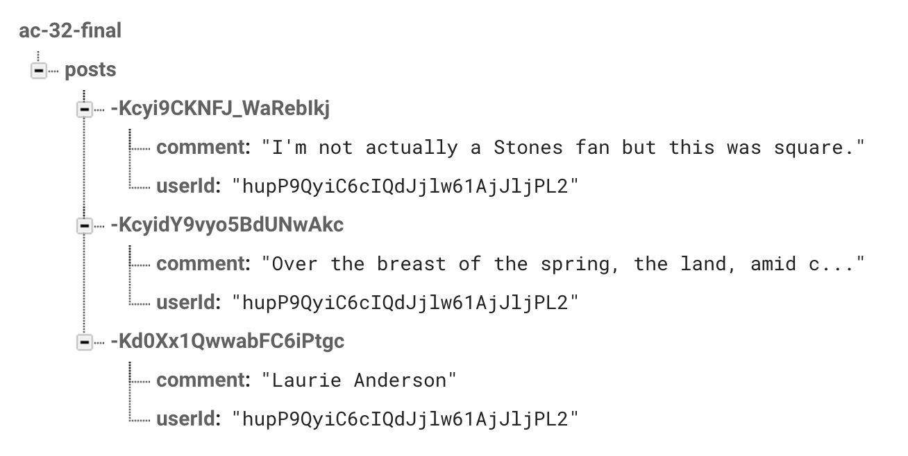
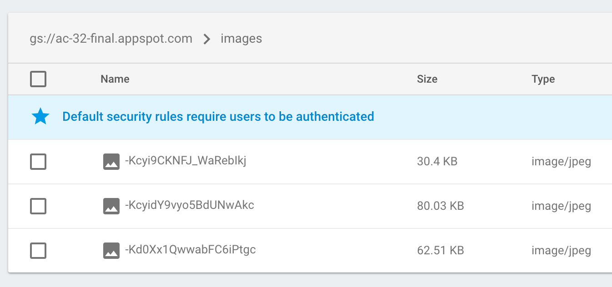

# AC3.2 Final - Practical

## Objective

Build an Instagram-like app for posting images with comments.

## Summary

The app comprises three view controllers: a feed, an upload page and a login page. The designs to follow
will illustrate and specify the design and relationship of these view controllers.
 The backend is powered by Firebase. 
We will be working in a shared environment, reading and writing from the same database
and storage area. This is not unlike a real-world organization where, as a developer, you don't 
have full control of the data and therefore need to program defensively. Someone might create an
incomplete object or fail to establish a necessary connection between objects.

## Login

In contrast to the Unit 6 Project App which allowed limited anonymous usage, this app will
require the user to log in before he/she can access the rest of the app. 


## Main View: Feed

Each post in the feed has two elements: a picture and a comment. The picture is a fixed square the width
of the device and the text is variable height below it, resulting in non-uniform cell heights.
Therefore use Auto Layout to drive automatic cell heights.


## Upload View


## XCode Workspace

* Includes all assets needed
* Includes the GoogleService-Info.plist needed to connect to Firebase
* Includes all necessary Firebase Pods
* Includes SnapKit
* Includes the default Storyboard. You can edit it to add your interface or build
	your interface programmatically

## Backend

### Authentication

Email/Password authentication is enabled so you can register and log users in. Anonymous
authentication is also enabled in case you need to fall back to it. 

### Database

The simple schema is illustrated by this diagram:



### Storage

The file structure of the storage is illustrated here: 



Note the relationship between image names and objects in the database.

#### Uploading Images

Be sure to render your images into compressed JPEG format as we did in the review.
Here's a line of code that takes a ```UIImage``` and generates a ```Data``` object
with JPEG data. 

```swift
let image: UIImage = ...obtain uiimage somehow...
let data = UIImageJPEGRepresentation(image, 0.5)
```


## Individual Screen Details

### Login
---

---

---

---

---

---


### Feed


---

---


### Upload


---

---


